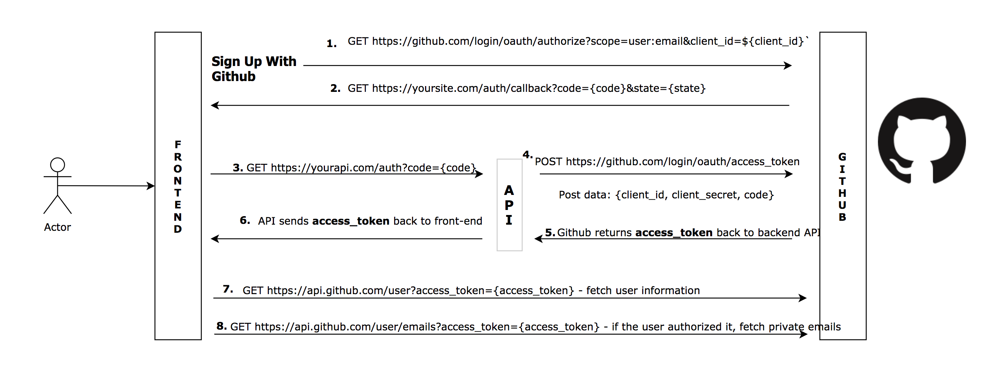
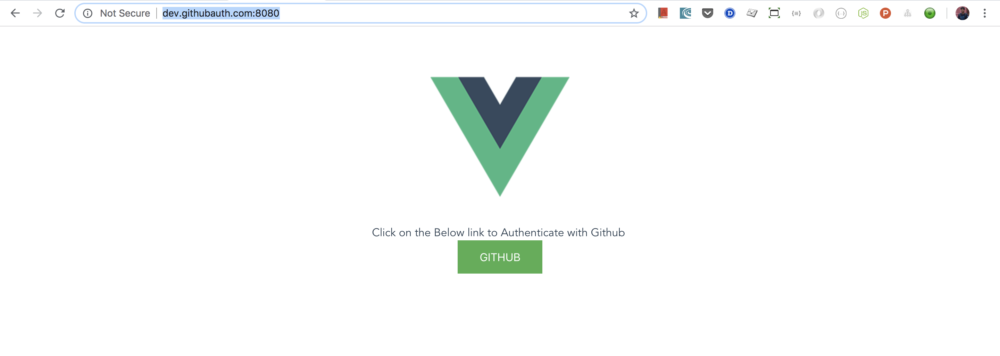

# VueJs Githug Authentication

## Description

VueJs Github Authentication Example

Unlike other social authentications, Github authentication flow is bit different and requires to go through frontend and backend calls to get the user to authorise to your app.


### Githun Web Authentication Application Flow

* Redirect to this link to request GitHub access:

<pre><code>https://github.com/login/oauth/authorize?
  client_id=...&
  redirect_uri=http://www.example.com/oauth_redirect</code></pre>

* If the user accepts your request, GitHub redirects back to your site with 
  a temporary code in a `code` parameter.  Exchange this for an access token:

<pre><code>POST https://github.com/login/oauth/access_token?
  client_id=...&
  redirect_uri=http://www.example.com/oauth_redirect&
  client_secret=...&
  code=...

RESPONSE:
access_token=...</code></pre>

__Github does not allow you to make above POST request from the browser directly due to security issue, this is the step Github documentation fails to explain. One would have to make that call through backend API call. This is the part that confuses many developers as Github documentation is not that clear__

* You have the access token, so now you can make requests on the user's behalf:

<pre><code>GET https://api.github.com/user?
  access_token=...</code></pre>

<pre><code>GET https://api.github.com/user/emails?
  access_token=...</code></pre>

## Auth Flow Diagram



## Project setup

This repo is _Front end_

API is https://github.com/manjufy/nodejs-github-auth/

To make both frontend and backend work together with the same domain name, add this to your hosts file `dev.githubauth.com` or any localhost name you prefer

### To run the front end i.e. the current repo


```
git clone https://github.com/manjufy/vuejs-github-auth.git

cd > vuejs-github-auth

npm install

npm run serve // Compiles and hot-reloads for development

npm run build  // Compiles and minifies for production (optional)
```

Then Visit http://dev.githubauth.com:8080/



__Also make sure to run API__

Refer: https://github.com/manjufy/nodejs-github-auth/

### TODO

- Call Github API with access_token to get User information
- Call Github API with access_token to get User emails
- Implement NPM Package to get acces_token

### Github Authentication

https://developer.github.com/v3/guides/basics-of-authentication/

https://developer.github.com/apps/building-oauth-apps/authorizing-oauth-apps/
